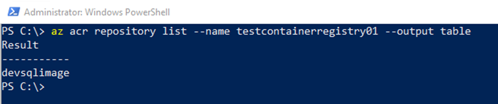

# SQL Containers in the Cloud

---

## Andrew Pruski

### SQL Server DBA & Microsoft Data Platform MVP

@fa[twitter] @dbafromthecold  
@fa[envelope] dbafromthecold@gmail.com  
@fa[wordpress] www.dbafromthecold.com  
@fa[github] github.com/dbafromthecold

---

### Session Aim

To give an overview of the different options available to run SQL Server Docker containers in Azure

---

### Agenda

Azure Container Registry  
Azure Container Instances  
Azure Container Services

---

## Azure Container Registry

---

### Azure Container Registry

@size[0.6em](https://azure.microsoft.com/en-us/services/container-registry/)

---

### Terminology

<b>Registry</b> 
Service that stores container images 
 
<b>Repository</b> 
Groups of container images – Same name, identified by tags 
	
---

### Features

<b>Encryption</b> 
All images encrypted at rest 
<b>Geo-redundant storage</b> 
Replication of images 
<b>Geo-replication</b> 
Guards against total regional failure 
<b>ACR Build</b> 
Container image build service 

---

### SKUs

---?code=assets/code/acr_login.azcli&lang=bash&title=ACR Login

---?code=assets/code/acr_create_resource_group.azcli&lang=bash&title=Create Resource Group

---?code=assets/code/acr_create_registry.azcli&lang=bash&title=Create Registry

---?code=assets/code/acr_login_registry.azcli&lang=bash&title=Log into Registry

---?code=assets/code/acr_get_registry_details.azcli&lang=bash&title=Get Registry Details

---?code=assets/code/dockerfile&lang=bash&title=Dockerfile

---?code=assets/code/acr_build_image.azcli&lang=bash&title=Build Container Image

---?code=assets/code/acr_tag_image.azcli&lang=bash&title=Tag Image

---?code=assets/code/acr_push_image.azcli&lang=bash&title=Push Image

---?code=assets/code/acr_list_repos.azcli&lang=bash&title=List Repositories

---?code=assets/code/acr_show_tags.azli&lang=bash&title=Show Tags

---?code=assets/code/acr_show_manifests.azcli&lang=bash&title=Show Manifests

---

## Demo

---

## Azure Container Instances

---

 
 
 
 
### Questions?

