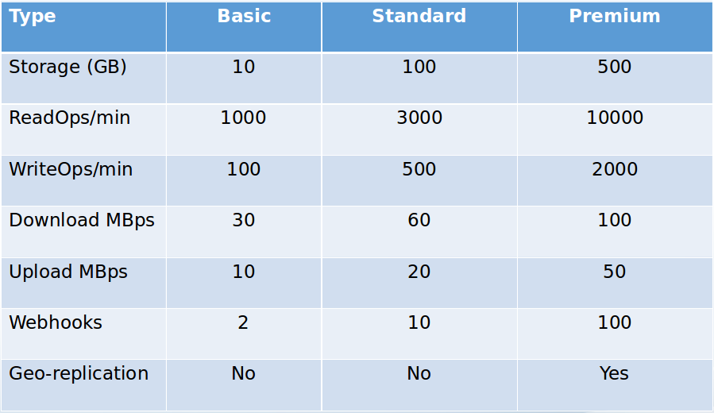
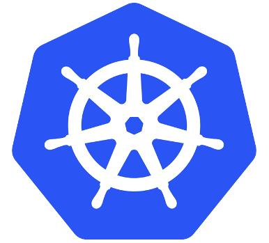
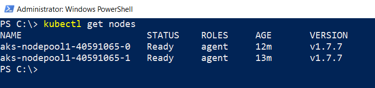
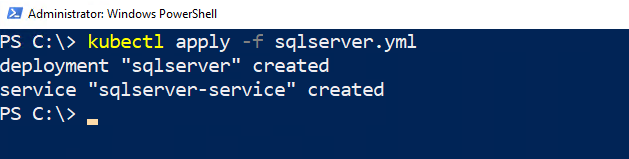

# SQL Server Containers in Azure

---

## Andrew Pruski

### SQL Server DBA & Microsoft Data Platform MVP

@fa[twitter] @dbafromthecold  
@fa[envelope] dbafromthecold@gmail.com  
@fa[wordpress] www.dbafromthecold.com  
@fa[github] github.com/dbafromthecold

---

### Session Aim

To give an overview of the different options available to run SQL Server containers in Azure

---

### Agenda

Azure Container Registry  
Azure Container Instances  
Azure Container Services

---

## Azure Container Registry

---

### Azure Container Registry

@size[0.8em](https://azure.microsoft.com/en-us/services/container-registry/)

---

### Terminology

<b>Registry</b> 
Service that stores container images 
 
<b>Repository</b> 
Groups of container images – Same name, identified by tags 
	
---

### Features

<b>Encryption</b> 
All images encrypted at rest 
<b>Geo-redundant storage</b> 
Replication of images 
<b>Geo-replication</b> 
Guards against total regional failure 
<b>ACR Tasks</b> 
Container image build service 

---

### SKUs

---?code=assets/code/acr_login.azcli&lang=bash&title=Login to Azure Account

---?code=assets/code/acr_create_resource_group.azcli&lang=bash&title=Create Resource Group

---?code=assets/code/acr_create_registry.azcli&lang=bash&title=Create Registry

---?code=assets/code/acr_login_registry.azcli&lang=bash&title=Log into Registry

---?code=assets/code/acr_get_registry_details.azcli&lang=bash&title=Get Registry Details

---?code=assets/code/dockerfile&lang=bash&title=Dockerfile

@[1](Building from microsoft image)
@[3](Create directory within container)
@[5-6](Copy database files into container)
@[8-10](Set SQL default directories)
@[12-13](Healthcheck (10 seconds))
@[14-16](Create database from files)

---?code=assets/code/acr_build_image.azcli&lang=bash&title=Build Container Image

---?code=assets/code/acr_tag_image.azcli&lang=bash&title=Tag Image

---?code=assets/code/acr_push_image.azcli&lang=bash&title=Push Image

---?code=assets/code/acr_list_repos.azcli&lang=bash&title=List Repositories

---?code=assets/code/acr_show_tags.azcli&lang=bash&title=Show Tags

---

## Demo

---

## Azure Container Instances

---

### Azure Container Instances

@size[0.8em](https://azure.microsoft.com/en-us/services/container-instances/)

---

### Azure Container Instances

Running containers without servers  
No need to manage VMs  
Quick deployment  
Deployed via the CLI, powershell, or Azure Portal  
Billed by the second

---

### Options

Linux & Windows containers  
Containers exposed directly to the internet  
IP Address and FQDN  
Hypervisor level isolation <rb>
Persistent storage  
Azure files shares

---

### Container Groups

Similar in concept to K8s pods  
Multiple containers running on the same host  
Share IP address, containers exposed on ports  
Supports mounting external volumes

---?code=assets/code/aci_get_credentials.azcli&lang=bash&title=Get Credentials

@[1](Enable admin)
@[3](Show credentials)

---?code=assets/code/aci_create_keyvault.azcli&lang=bash&title=Create Keyvault

@[1-2](Create keyvault)
@[4-10](Create service principle and store password)
@[12-16](Store username)

---?code=assets/code/aci_create_container.azcli&lang=bash&title=Create Container

@[2](From custom image)
@[3](Specifying the resource group)
@[4-7](Retrieving the username stored in keyvault)
@[8-11](Retrieving the password stored in keyvault)
@[12](Setting the container name)
@[13](Specifying resources available to container)
@[14](Setting the required environment variables)
@[15](Specifying the IP address type)
@[16](Specifying the port to connect to)

---?code=assets/code/aci_get_container_status.azcli&lang=bash&title=Get Container Status

---

### Connect to Azure Container Instance

---

## Demo

---

## Azure Container Services

---

### Azure Container Services

@size[0.8em](https://azure.microsoft.com/en-us/services/container-service/)

---

### Azure Container Services

 <b>Two flavours</b>  
Azure Container Services (ACS)  
Azure Container Services (AKS)  
 
ACS allows multiple orchestrators  
AKS is specifically built to implement Kubernetes

---

### Kubernetes

 
@size[0.9em](Open source)  
@size[0.9em](Deployed as a cluster)  
@size[0.9em](Pods hold containers on nodes)  
@size[0.9em](Services provide external access)  
@size[0.9em](Kubectl used to manage cluster)  

---

### Azure Container Services (AKS)

Simplifies deployment of Kubernetes clusters  
Cluster can be spun up with one line of code  
Applications deployed to cluster via yaml files  
Managed by Azure-CLI/powershell and kubectl  

---?code=assets/code/aks_create_cluster.azcli&lang=bash&title=Create Cluster

@[2](Specify the resource group)
@[3](Give the cluster a name)
@[4](Specify the number of nodes)
@[5](Generate keys so that we can connect)

---?code=assets/code/aks_install_kubectl.azcli&lang=bash&title=Install Kubectl

---?code=assets/code/aks_get_cluster_credentials.azcli&lang=bash&title=Get Cluster Credentials

---?code=assets/code/aks_view_cluster_nodes.azcli&lang=bash&title=View Cluster Nodes

---?code=assets/code/aks_create_role.azcli&lang=bash&title=Create Role

@[1-5](Get cluster ID)
@[7-11](Get Azure Container Registry ID)
@[13-16](Create role to allow access to ACR)

---?code=assets/code/aks_yaml_file.yaml&lang=yaml&title=AKS yaml file

@[3-6](Metadata of deployment)
@[8](Number of replicas)
@[13-23](Pod declaration)
@[15](Pod name)
@[16](Image to be used)
@[17-18](Port on pod)
@[19-23](Setting environment variables)
@[24-35](Service)
@[26-27](Metadata)
@[29-32](Port on service to port on pod)
@[33-35](Selector)
@[35](External IP address)

---?code=assets/code/aks_deploy_to_cluster.azcli&lang=bash&title=Deploy to Cluster

---?code=assets/code/aks_deployment_info.azcli&lang=bash&title=View Deployment

@[1](View deployments)
@[2](View nodes)
@[3](View services)

---

### Connect to SQL Server

---

### Kubernetes Dashboard

---

## Demo

---

### Resources

https://github.com/dbafromthecold/ContainersInTheCloud

@snap[east]

@snapend
