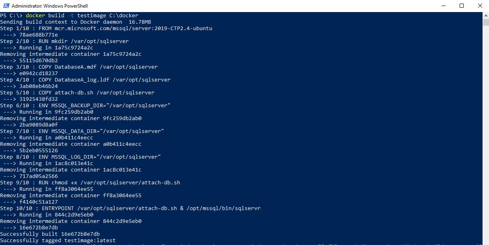
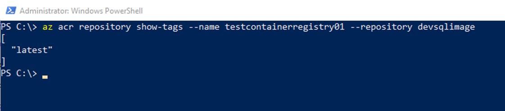

# SQL Containers in the Cloud

---

## Andrew Pruski

### SQL Server DBA & Microsoft Data Platform MVP

@fa[twitter] @dbafromthecold  
@fa[envelope] dbafromthecold@gmail.com  
@fa[wordpress] www.dbafromthecold.com  
@fa[github] github.com/dbafromthecold

---

### Session Aim

To give an overview of the different options available to run SQL Server Docker containers in Azure

---

### Agenda

Azure Container Registry  
Azure Container Instances  
Azure Container Services

---

## Azure Container Registry

---

### Azure Container Registry

@size[0.6em](https://azure.microsoft.com/en-us/services/container-registry/)

---

### Terminology

<b>Registry</b> 
Service that stores container images 
 
<b>Repository</b> 
Groups of container images – Same name, identified by tags 
	
---

### Features

<b>Encryption</b> 
All images encrypted at rest 
<b>Geo-redundant storage</b> 
Replication of images 
<b>Geo-replication</b> 
Guards against total regional failure 
<b>ACR Build</b> 
Container image build service 

---

### SKUs

---?code=assets/code/acr_login.azcli&lang=bash&title=ACR Login

---?code=assets/code/acr_create_resource_group.azcli&lang=bash&title=Create Resource Group

---?code=assets/code/acr_create_registry.azcli&lang=bash&title=Create Registry

---?code=assets/code/acr_login_registry.azcli&lang=bash&title=Log into Registry

---?code=assets/code/acr_get_registry_details.azcli&lang=bash&title=Get Registry Details

---?code=assets/code/dockerfile&lang=bash&title=Dockerfile

---?code=assets/code/acr_build_image.azcli&lang=bash&title=Build Container Image

---?code=assets/code/acr_tag_image.azcli&lang=bash&title=Tag Image

---?code=assets/code/acr_push_image.azcli&lang=bash&title=Push Image

---?code=assets/code/acr_list_repos.azcli&lang=bash&title=List Repositories

---?code=assets/code/acr_show_tags.azli&lang=bash&title=Show Tags

---?code=assets/code/acr_show_manifests.azcli&lang=bash&title=Show Manifests

---

## Demo

---

## Azure Container Instances

---

### Azure Container Instances

@size[0.6em](https://azure.microsoft.com/en-us/services/container-instances/)

---

### Azure Container Instances

Running containers without servers  
No need to manage VMs  
Quick deployment  
Deployed via the CLI, powershell, or Azure Portal  
Billed by the second

---

### Options

Linux & Windows containers  
Containers exposed directly to the internet  
IP Address and FQDN  
Hypervisor level isolation <rb>
Persistent storage  
Azure files shares

---

### Container Groups

Similar in concept to K8s pods  
Multiple containers running on the same host  
Share IP address, containers exposed on ports  
Supports mounting external volumes

---?code=assets/code/aci_get_credentials.azcli&lang=bash&title=ACI - Get Credentials

@[1](Enable admin)
@[3](Show credentials)

---?code=assets/code/aci_create_keyvault.azcli&lang=bash&title=ACI - Create Keyvault

@[1](Create keyvault)
@[3-9](Create service principle and store password)
@[11-15](Store username)

---?code=assets/code/aci_create_container.azcli&lang=bash&title=ACI - Create Container

@[2](From custom image)
@[3](Specifying the resource group)
@[4-7](Retrieving the username stored in keyvault)
@[8-11](Retrieving the password stored in keyvault)
@[12](Setting the container name)
@[13](Specifying resources available to container)
@[14](Setting the required environment variables)
@[15](Specifying the IP address type)
@[16](Specifying the port to connect to)

---?code=assets/code/aci_get_container_status.azcli&lang=bash&ACI - Get Container Status

---

### Connect to Azure Container Instance

---

## Demo

---

## Azure Container Services

---

### Azure Container Services

@size[0.6em](https://azure.microsoft.com/en-us/services/container-service/)

---

### Azure Container Services

Two flavours  
Azure Container Services (ACS)  
Azure Container Services (AKS)  
 
ACS provides container hosting using DC/OS, Swarm, or K8s  
AKS is specifically built to implement Kubernetes

---

### Kubernetes

@size[0.6em](test text)  
@size[0.6em](test text)  
@size[0.6em](test text)  
@size[0.6em](test text)  
@size[0.6em](test text)  

---

Open Source system for managing containers  
Deployed as a cluster containing a master and multiple nodes  
Pods hold containers running on the nodes  
Services define/allow access to sets of pods  
Deployments created and managed via Kubectl  

---

### Azure Container Services (AKS)

Simplifies deployment of Kubernetes clusters  
Cluster can be spun up with one line of code  
Applications deployed to cluster via yaml files  
Managed by Azure-CLI/powershell and kubectl  

---?code=assets/code/aks_create_cluster.azcli&lang=bash&title=Create Cluster

@[2](Specify the resource group)
@[3](Give the cluster a name)
@[4](Specify the number of nodes)
@[5](Generate keys so that we can connect)

---?code=assets/code/aks_get_details.azcli&lang=bash&title=Get Cluster and ACR Details

@[1-4](Get cluster ID)
@[6-10](Get Azure Container Registry ID)

---?code=assets/code/aks_create_role.azcli&lang=bash&title=Create role to grant access

@[2](AKS Cluster ID)
@[4](Azure Container Registry ID)

---?code=assets/code/aks_yaml_file.yaml&lang=bash&title=AKS yaml file

---?code=assets/code/aks_deploy_to_cluster.azcli&lang=bash&title=Deploy to cluster

---?code=assets/code/aks_deployment_info.azcli&lang=bash&title=View deployment information

@[1](View deployments)
@[2](View nodes)
@[3](View services)

---

### Connect to SQL Server

---

### Kubernetes Dashboard

---

## Demo

---

### Resources

@size[0.6em](https://azure.microsoft.com/en-us/services/container-registry/)  
@size[0.6em](https://azure.microsoft.com/en-us/services/container-instances/)  
@size[0.6em](https://azure.microsoft.com/en-us/services/container-service/)  
@size[0.6em](https://dbafromthecold.com/2017/03/15/summary-of-my-container-series/)  
@size[0.6em](https://github.com/dbafromthecold/ContainersInTheCloud)

---

 
 
 
 
### Questions?

